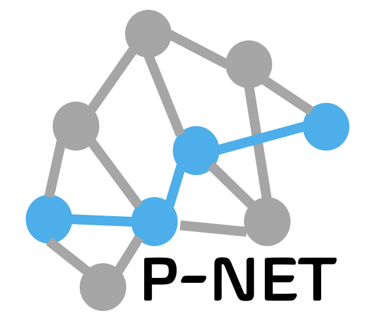
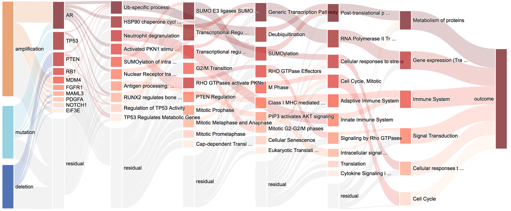

<!--
MIT License

Copyright (c) 2018 Othneil Drew

Permission is hereby granted, free of charge, to any person obtaining a copy
of this software and associated documentation files (the "Software"), to deal
in the Software without restriction, including without limitation the rights
to use, copy, modify, merge, publish, distribute, sublicense, and/or sell
copies of the Software, and to permit persons to whom the Software is
furnished to do so, subject to the following conditions:

The above copyright notice and this permission notice shall be included in all
copies or substantial portions of the Software.

THE SOFTWARE IS PROVIDED "AS IS", WITHOUT WARRANTY OF ANY KIND, EXPRESS OR
IMPLIED, INCLUDING BUT NOT LIMITED TO THE WARRANTIES OF MERCHANTABILITY,
FITNESS FOR A PARTICULAR PURPOSE AND NONINFRINGEMENT. IN NO EVENT SHALL THE
AUTHORS OR COPYRIGHT HOLDERS BE LIABLE FOR ANY CLAIM, DAMAGES OR OTHER
LIABILITY, WHETHER IN AN ACTION OF CONTRACT, TORT OR OTHERWISE, ARISING FROM,
OUT OF OR IN CONNECTION WITH THE SOFTWARE OR THE USE OR OTHER DEALINGS IN THE
SOFTWARE.
-->

<!--
*** Thanks for checking out the Best-README-Template. If you have a suggestion
*** that would make this better, please fork the repo and create a pull request
*** or simply open an issue with the tag "enhancement".
*** Thanks again! Now go create something AMAZING! :D
***
***
***
*** To avoid retyping too much info. Do a search and replace for the following:
*** marakeby, pnet_prostate_paper, twitter_handle, email, P-NET, project_description
-->


<!-- PROJECT SHIELDS -->
<!--
*** I'm using markdown "reference style" links for readability.
*** Reference links are enclosed in brackets [ ] instead of parentheses ( ).
*** See the bottom of this document for the declaration of the reference variables
*** for contributors-url, forks-url, etc. This is an optional, concise syntax you may use.
*** https://www.markdownguide.org/basic-syntax/#reference-style-links
-->
[![Contributors][contributors-shield]][contributors-url]
[![Forks][forks-shield]][forks-url]
[![Stargazers][stars-shield]][stars-url]
[![Issues][issues-shield]][issues-url]
[![GPL-2.0 License][license-shield]][license-url]
[![LinkedIn][linkedin-shield]][linkedin-url]


<!-- PROJECT LOGO -->
<br />
<p align="center">
  <a href="https://github.com/marakeby/pnet_prostate_paper">
    
  </a>

<h2 align="center">P-NET</h2>

  <p align="center">
    P-NET, Biologically informed deep neural network for prostate cancer classification and discovery
    <br />
    <br />
    <br />
    <a href="https://htmlpreview.github.io/?https://github.com/marakeby/pnet_prostate_paper/blob/master/_plots/figure3/sankey_full.html">view interactive network architecture</a>
    ·
    ·
  </p>
</p>


<!-- TABLE OF CONTENTS -->
<details open="open">
  <summary><h2 style="display: inline-block">Table of Contents</h2></summary>
  <ol>
    <li>
      <a href="#about-the-project">About The Project</a>
    </li>
    <li>
      <a href="#getting-started">Getting Started</a>
      <ul>
        <li><a href="#prerequisites">Prerequisites</a></li>
        <li><a href="#installation">Installation</a></li>
      </ul>
    </li>
    <li><a href="#usage">Usage</a></li>
    <li><a href="#References">References</a></li>
    <li><a href="#license">License</a></li>
    <li><a href="#contact">Contact</a></li>
    <li><a href="#acknowledgements">Acknowledgements</a></li>
  </ol>
</details>


<!-- ABOUT THE PROJECT -->

## About The Project

<p align="center">
  <a href="https://github.com/marakeby/pnet_prostate_paper">
    
  </a>
  </p>


Biologically informed deep neural network for prostate cancer classification and discovery

<!-- GETTING STARTED -->

## Getting Started

To get a local copy up and running, follow these simple steps

### Prerequisites

* python 2.7, check environments.yml for list of needed packages

### Installation

1. Clone the repo
   ```sh
   git clone https://github.com/marakeby/pnet_prostate_paper.git
   ```
2. Create conda environment
   ```sh
   conda env create --name pnet_env --file=environment.yml
   ```
3. Based on your use, you may need to download one or more of the following

   a. [Data files](https://drive.google.com/uc?id=17nssbdUylkyQY1ebtxsIw5UzTAd0zxWb&export=download) (needed to retrain
   models and generate figures). Extract the files under ```_database``` directory. If you like to store it somewhere
   else, you may need to set the ```DATA_PATH``` variable in ```config_path.py``` accordingly.

   b. [Log files](https://drive.google.com/uc?id=18dJ5fWvJyISROkLRCUMfhsrwZ_iNXSNP&export=download) (needed to
   regenerate paper figures). Extract the files under ```_logs``` directory. If you like to store it somewhere else, you
   may need to set the ```LOG_PATH``` variable in ```config_path.py``` accordingly.

   c. [Plots files](https://drive.google.com/uc?id=1DiZB8qvZqVXs9HyDCF7bCFOr_T1ER7Ku&export=download) (a copy of the
   paper images). Extract the files under ```_plots``` directory. If you like to store it somewhere else, you may need
   to set the ```PLOTS_PATH``` variable in ```config_path.py``` accordingly.

<!-- USAGE EXAMPLES -->

## Usage

1. Activate the created conda environment
   ```sh
   source activate pnet_env
   ```
2. Add the current diretory to PYTHONPATH, e.g.

   ```sh
   export PYTHONPATH=~/pnet_prostate_paper:$PYTHONPATH
   ```

3. To generate all paper figures, run
     ```sh
   cd ./analysis
   python run_it_all.py
   ```

4. To generate individual paper figure run the different files under the 'analysis' directory, e.g.
     ```sh
   cd ./analysis
   python figure_1_d_auc_prc.py
   ```
   For ```Figure3``` , make sure you run ```prepare_data.py``` before running other files
5. To re-train a model from scratch run
   ```sh
   cd ./train
   python run_me.py
   ```
   This will run an experiment 'pnet/onsplit_average_reg_10_tanh_large_testing' which trains a P-NET model on a
   training-testing data split of Armenia et al data set and compare it to a simple logistic regression model. The
   results of the experiment will be stored under ```_logs```in a directory with the same name as the experiment.  
   To run another experiment, you may uncomment one of the lines in the run_me.py to run the corresponding experiment.
   Note that some models especially cross validation experiments may be time consuming.

<!-- LICENSE -->

## License

Distributed under the GPL-2.0 License License. See `LICENSE` for more information.


<!-- CONTACT -->

## Contact

Haitham - [@HMarakeby](https://twitter.com/HMarakeby)

Project Link: [https://github.com/marakeby/pnet_prostate_paper](https://github.com/marakeby/pnet_prostate_paper)


<!-- References -->

## References
* Elmarakeby H, et al. "Biologically informed deep neural network for prostate cancer classification and discovery." Nature. Online September 22, 2021. DOI: 10.1038/s41586-021-03922-4
* Armenia, Joshua, et al. "The long tail of oncogenic drivers in prostate cancer." Nature genetics 50.5 (2018): 645-651.
* Robinson, Dan R., et al. "Integrative clinical genomics of metastatic cancer." Nature 548.7667 (2017): 297-303.
* Fraser, Michael, et al. "Genomic hallmarks of localized, non-indolent prostate cancer." Nature 541.7637 (2017):
  359-364.

<!-- ACKNOWLEDGEMENTS -->

## Acknowledgements
This work was supported in part by the Fund for Innovation in Cancer Informatics, Mark Foundation, Prostate Cancer Foundation, Movember, and the National Cancer Institute at the National Institutes of Health.


<!-- MARKDOWN LINKS & IMAGES -->
<!-- https://www.markdownguide.org/basic-syntax/#reference-style-links -->

[contributors-shield]: https://img.shields.io/github/contributors/marakeby/pnet_prostate_paper.svg?style=for-the-badge

[contributors-url]: https://github.com/marakeby/pnet_prostate_paper/graphs/contributors

[forks-shield]: https://img.shields.io/github/forks/marakeby/pnet_prostate_paper.svg?style=for-the-badge

[forks-url]: https://github.com/marakeby/pnet_prostate_paper/network/members

[stars-shield]: https://img.shields.io/github/stars/marakeby/pnet_prostate_paper.svg?style=for-the-badge

[stars-url]: https://github.com/marakeby/pnet_prostate_paper/stargazers

[issues-shield]: https://img.shields.io/github/issues/marakeby/pnet_prostate_paper.svg?style=for-the-badge

[issues-url]: https://github.com/marakeby/pnet_prostate_paper/issues

[license-shield]: https://img.shields.io/github/license/marakeby/pnet_prostate_paper.svg?style=for-the-badge

[license-url]: https://github.com/marakeby/pnet_prostate_paper/blob/master/LICENSE.txt

[linkedin-shield]: https://img.shields.io/badge/-LinkedIn-black.svg?style=for-the-badge&logo=linkedin&colorB=555

[linkedin-url]: https://linkedin.com/in/haitham-elmarakeby-29030119
